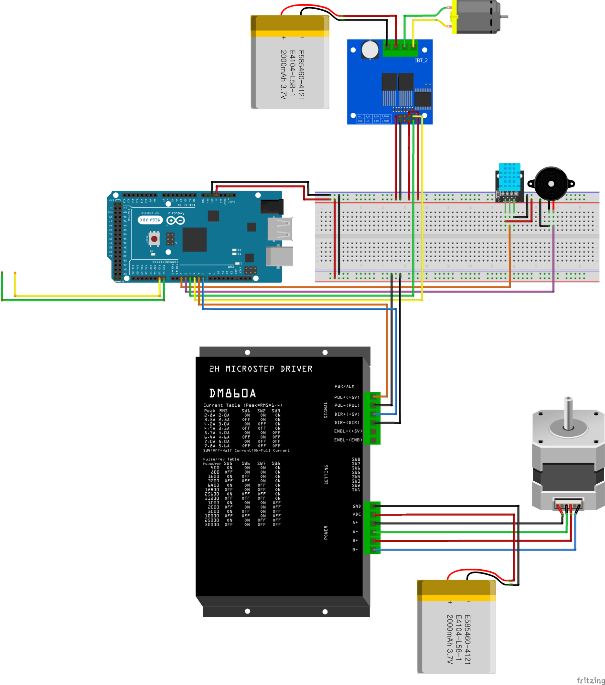
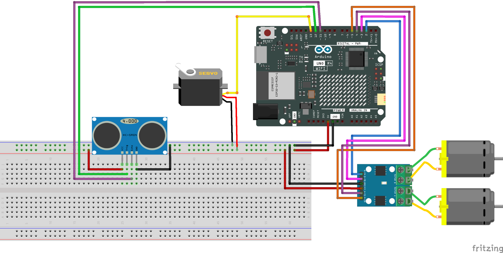
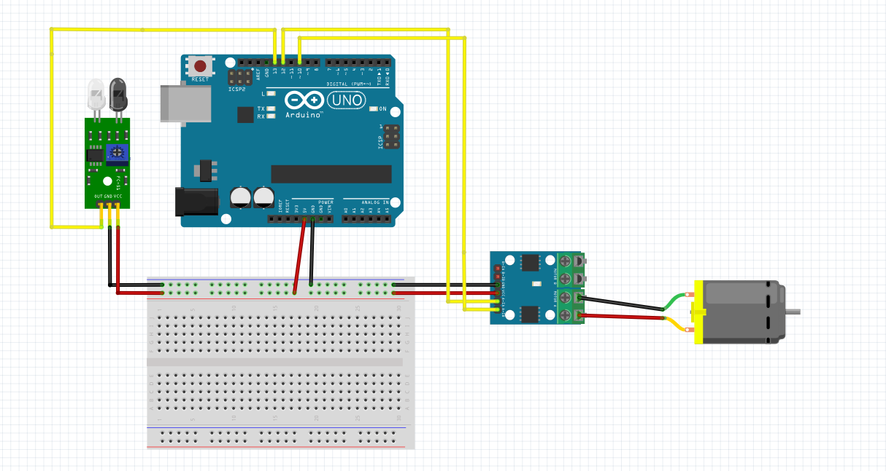

# PCB Automation System

컨베이어, 실린더, 로봇팔 및 AGV를 연동하여 PCB 검사와 물류 이송 과정을 자동화한 프로젝트입니다.

## System Overview

PCB 검사 결과에 따라 실린더가 불량품을 분류하고, 정상 PCB는 컨베이어를 통해 적재됩니다. 적재가 완료되면 AGV가 제품을 지정된 위치로 운반합니다.

## System Circuit Diagrams

### Main Controller Circuit

### AGV Circuit

### Conveyor Circuit

## Source Code

| File | Description |
|---|---|
| `AGV.ino` | AGV 주행 및 라인 트레이싱 제어 |
| `Cylinder.ino` | 불량 PCB 배출 실린더 제어 |
| `Conveyor.ino` | 컨베이어 벨트 및 센서 제어 |

## Main Components

- Arduino Uno
- Arduino Mega
- Arduino UNO R4 WiFi
- DC Motor Driver
- Stepper Motor Driver
- Pneumatic Cylinder
- Conveyor Belt
- Line Tracking Sensor
- Ultrasonic Sensor
- Servo Motor
- AGV Platform

## System Operation

1. 컨베이어를 통해 PCB가 이동합니다.
2. 검사 결과에 따라 정상품과 불량품을 구분합니다.
3. 불량품은 실린더를 이용해 배출합니다.
4. 정상품은 박스에 적재합니다.
5. 적재 완료 후 AGV가 제품을 운반합니다.
